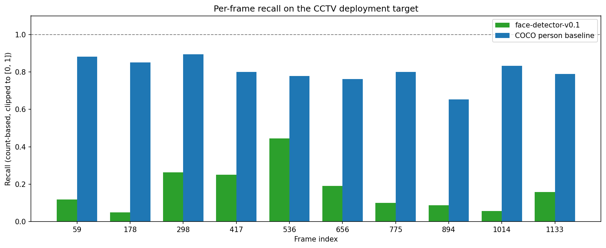
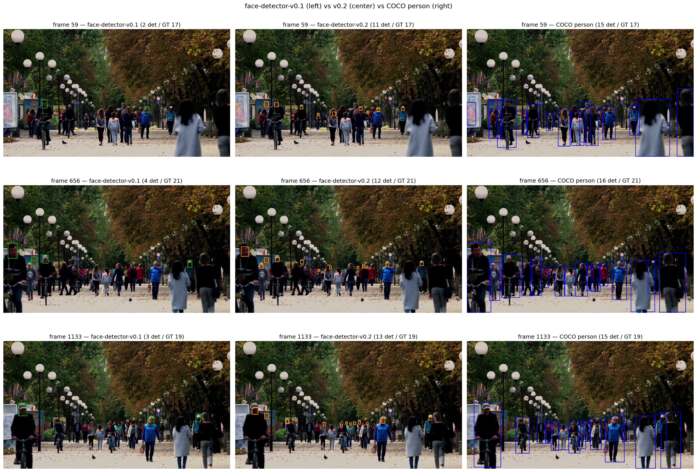

# Problem Statement

The widespread adoption of video surveillance among Italian small and medium
enterprises (SMEs) has created a regulatory paradox: the same technology that
protects people and assets exposes their data to significant compliance risks
under the General Data Protection Regulation (GDPR, EU 2016/679). A CCTV camera
in a retail store, an office, or a logistics site daily captures dozens of
recognizable faces (employees, customers, visitors) that constitute personal
data under Article 4 of the GDPR. It is worth specifying that CCTV footage does
not automatically qualify as biometric data protected under Article 9: this
category applies only when images are processed through facial recognition
systems for the unique identification of a natural person. However, even within
the standard personal data regime, the data controller is required to adopt
technical and organizational measures proportionate to risk, in accordance with
the principles of accountability (Art. 5.2) and privacy by design (Art. 25).
When recordings must be retained beyond the ordinary term, shared with third
parties (insurance companies, law enforcement, audits), or even partially
published, these measures must concretely reduce the identifiability of the
subjects captured. For the average Italian SME, which typically lacks a
dedicated Data Protection Officer and a substantial IT budget, this requirement
often translates into inaction: videos are deleted for safety or, worse,
retained in violation, with exposure to the sanctions provided under Article
83.5 of the GDPR, up to 20 million euros or 4% of annual worldwide turnover.

Existing market solutions polarize into two segments that leave the intermediate
space uncovered. On one side, solutions such as Brighter AI or Pimloc Secure
Redact offer production-grade pipelines targeting the enterprise segment,
typically with pricing that is not publicly listed or tied to consumption/volume
models. This commercial orientation makes them inaccessible to IT consultants
serving SMEs as an off-the-shelf purchase. On the other side, manual solutions
based on professional video editors (Adobe Premiere, DaVinci Resolve) require
expert operators and production time linear in the number of frames,
economically prohibitive on realistic CCTV volumes. Numerous open-source face
blurring projects also exist (typically educational notebooks or single-file
scripts on GitHub), but they rarely offer the level of engineering rigor
required for professional deployment: automated testing, continuous integration,
explicit versioning of models and datasets, traceable architectural decisions.
The opportunity space for IT consultants working with Italian SMEs is therefore
a system that combines accessibility (open-source, self-hostable) with
engineering maturity (auditable, tested, documented), characteristics that the
GDPR itself rewards through the accountability principle of Article 5.2.

Privify is designed to occupy this space. It is an open-source computer vision
pipeline that automatically detects faces in CCTV footage and applies a
configurable Gaussian blur as a visual redaction measure. Whether this operation
qualifies as anonymization in the strict GDPR sense (Recital 26) depends on
contextual parameters such as blur intensity, frame resolution, and the presence
of other identifiers in the scene. Recent research has demonstrated that
Gaussian blur can be partially attacked through deblurring and re-identification
techniques [citation placeholder: gaussian blur deanonymization paper]; the
system is therefore designed to allow the data controller to calibrate
parameters in an informed manner and to document the technical choice adopted.
The system combines a YOLOv8n detector fine-tuned on a single-class face dataset
(mAP@50 = 0.937 on the validation set) with a stateless OpenCV-based anonymizer.
The entire pipeline is written in Python, accompanied by an automated test
suite, continuous integration on GitHub Actions, and Architectural Decision
Records documenting every technical choice. The target deployment is the IT
consultant working with Italian SMEs: the system must run on a laptop or a small
server without dedicated GPU, process archived video in times acceptable for
batch use, and produce redacted output that the data controller can legitimately
retain or share. The extension of the detector to the license plate class, part
of Privify's original positioning for the Italian CCTV context (drive-through,
private parking, commercial entrances), is planned as future work for v0.2.

This report documents the development of Privify in its first iteration (v0.1),
from the initial architectural choice through the detector fine-tuning and the
empirical evaluation on test videos. The main contribution is not algorithmic
novelty: YOLOv8 and Gaussian blur are established techniques. It is instead the
engineering quality of the integration and the transparency with which both the
successes (high detection metrics in the in-distribution domain) and the limits
(qualitative failure on street-level CCTV scenes, due to a textbook case of
domain shift between training and deployment) are documented. The latter
evidence, far from constituting a defect to conceal, represents the true
didactic contribution of the project: a concrete demonstration of the gap
between performance metric and qualitative behavior that characterizes applied
machine learning, and an explicit roadmap to address it in subsequent
iterations.

# Methodology

## Pipeline Architecture

The pipeline's entry point is the `process_video` function in
`src/pipeline.py`, with the following signature:

```python
def process_video(
    input_path: Path,
    output_path: Path,
    *,
    mode: Literal["face", "person_upper", "person_full"] | None = None,
    detector: Detector | None = None,
    anonymizer: Anonymizer | None = None,
) -> ProcessingStats:
```

The use of the `*` marker enforces that `mode`, `detector`, and `anonymizer`
are provided as keyword arguments, preventing positional errors. The function
supports two alternative usage modalities: preset configuration via the `mode`
parameter (which automatically selects the appropriate detector/anonymizer
pair, described in §2.4), or explicit dependency injection of `Detector` and
`Anonymizer` instances for advanced scenarios. The internal resolver's
validation ensures that at least one of the two modalities is provided, raising
`ValueError` otherwise.

The main loop operates on frames read via `cv2.VideoCapture`, invoking for each
`detector.detect(frame)` and subsequently `anonymizer.anonymize(frame,
detections)`. The anonymized frame is written through `cv2.VideoWriter` with the
`mp4v` codec, chosen for its availability in any OpenCV build without external
dependencies (ffmpeg, H.264). Resource management adopts the `try`/`finally`
pattern to guarantee the release of `VideoCapture` and `VideoWriter` even in
case of exceptions during processing.

The final result is encapsulated in the frozen dataclass `ProcessingStats`,
which exposes the total frames processed, the cumulative number of detections,
the wall-clock time of processing, and the derived property `fps_processed`. The
dataclass's immutability reflects the nature of the result as a value object at
the end of an execution.

The architecture adopts three main design patterns. The Wrapper pattern
isolates external dependencies (Ultralytics YOLO for the detector, OpenCV for
the anonymizer) behind stable interfaces, allowing for potential future backend
swaps (for example to ONNX Runtime for inference optimizations). Lazy loading of
the YOLO model defers weight loading until the first call to `detect()`, making
`Detector` instantiation free and enabling fast unit tests with mocks.
Dependency injection centralizes in the `_resolve_components` resolver the
construction of the detector/anonymizer pair based on `mode`, while maintaining
the possibility of manual injection for testing and advanced use cases.

The entire implementation is covered by an automated test suite of 68 tests
distributed across 6 test modules, executed in continuous integration on GitHub
Actions. The four substantial modules in `src/` (`detector.py`, `anonymizer.py`,
`pipeline.py`, `training.py`) amount to approximately 590 effective lines of
code, excluding comments and blank lines.

## Detection Models

The system supports three configurable detection models, each trained on a
different image distribution. All are variants of Ultralytics' YOLOv8n
architecture, chosen for its balance of accuracy and footprint: 72 layers,
approximately 3 million parameters, 8.1 GFLOPs, and a disk footprint of around
6 MB. This choice is motivated by the declared deployment target (Italian SMEs
without dedicated GPUs), which requires inference executable on CPU or
entry-level consumer GPUs.

The first model, `face-detector-v0.1`, is obtained by fine-tuning YOLOv8n on
Mohamed Traore's Face Detection dataset (Roboflow Universe, CC BY 4.0 license),
composed of 1558 images of predominantly frontal close-up faces. This model is
published as a GitHub Release with verified SHA-256, and is the default of the
`Detector` wrapper when instantiated without arguments.

The second model, `face-detector-v0.2`, is a second iteration trained on a
3000-image subset extracted from WIDER FACE, biased toward the "hard" bin (faces
of area smaller than 0.5% of the image, a distribution that reflects the CCTV
deployment target). The rationale for this iteration is documented in §4
(Failure Analysis). This model is also published as a GitHub Release with
SHA-256 integrity verification.

The third "model" is not a fine-tuning but the official Ultralytics pre-trained
checkpoint `yolov8n.pt`, trained on COCO (80 classes). It is used by filtering
detections to the `person` class only, and provides a generic person detector as
a component of the hybrid modes described in §2.4. It is not versioned in the
repo (Ultralytics downloads it automatically on first use), and is cached
locally in `models/yolov8n.pt`.

The `Detector` wrapper accepts four optional parameters: `model_path` (path to
the `.pt` file, defaulting to `face-detector-v0.1.pt`), `conf_threshold`
(minimum confidence threshold, default 0.25, validated in (0, 1]), `device` (CPU
or CUDA, optional), and `class_filter` (list of class names to retain in the
result, optional). Detections are returned as instances of the frozen dataclass
`Detection`, exposing bounding box (a tuple of four integers in pixel
coordinates), confidence, class identifier, and class name.

## Anonymization

The anonymization of detected regions is implemented in `src/anonymizer.py`
through the stateless `Anonymizer` wrapper, which encapsulates the
`cv2.GaussianBlur` algorithm from OpenCV. The choice of Gaussian blur (over
pixelation or face replacement) is motivated by three factors. The first is
visual coherence: blur preserves the subject's motion and silhouette, keeping
the output video usable for non-identifying analysis (counts, flows, aggregate
behaviors). The second is the absence of external dependencies beyond OpenCV,
simplifying deployment. The third is documentary: compared to pixelation, whose
reversibility under controlled conditions is documented in the literature
(McPherson, Shokri, Shmatikov, 2016), Gaussian blur does not offer guarantees of
irreversible anonymization in an absolute sense. The system is therefore
designed to allow the data controller to calibrate parameters in an informed
manner.

The `Anonymizer` constructor accepts four parameters: `blur_kernel_size`
(positive odd integer, default 51), `min_bbox_size` (minimum width/height
threshold for applying blur, default 4 pixels), `box_mode` (literal `"full"` or
`"upper"`, default `"full"`), and `upper_fraction` (fraction of the upper
portion of the bounding box to blur in `"upper"` mode, default 0.30, validated
in (0, 1]). Parameter validation occurs in `__init__` with explanatory error
messages.

The flow of the `anonymize(frame, detections)` method is non-destructive: it
operates on a copy of the original frame, and returns immediately if no
detections are present. For each detection, the bounding box coordinates are
clamped to the frame edges; if the resulting crop dimension is smaller than
`min_bbox_size`, the detection is silently skipped (avoiding artifacts on
detections of negligible size). In `"full"` mode, the entire bounding box is
replaced with its blurred version. In `"upper"` mode, only the upper strip is
blurred, with height computed as `int(roi_h * upper_fraction)` and a guaranteed
minimum of one pixel to avoid degeneracies. The algorithm applies
`cv2.GaussianBlur` with a square kernel of side `blur_kernel_size` and sigma
automatically derived by OpenCV from the kernel size.

The module's test suite (10 tests in `tests/test_anonymizer.py`) covers the main
edge cases: empty detections, bounding boxes partially outside the frame,
dimensions below threshold, constructor parameter validation, and behavioral
equivalence between `"full"` mode and the pre-parameter behavior (regression
test).

## Hybrid Detection Strategy

The pipeline supports three preset anonymization modes, accessible via the
`mode` parameter of `process_video`. The motivation for this architectural
choice is documented in §4 (Failure Analysis) and is rooted in an empirical
measurement: the fine-tuned face detector v0.1 exhibits a recall of 17.2% on the
CCTV deployment target (10 street-level frames, manually annotated ground
truth), while the COCO person baseline reaches 80.4% on the same target. The 63
percentage point difference quantifies a structural gap between training domain
and deployment domain, which requires architectural mitigation in addition to
the algorithmic one (§4.3).

The `face` mode adopts the fine-tuned face detector (`face-detector-v0.1` by
default, replaceable with v0.2) and applies blur to the entire facial bounding
box. It is the suitable modality for close-range scenarios where the face is
visible and of significant size (intercoms, reception desks, public-facing
counters).

The `person_upper` mode adopts the COCO baseline with filtering to the `person`
class, and applies blur to the upper strip of the person's bounding box (30% of
the height), as a proxy for the head-shoulder region. This modality prioritizes
coverage over anatomical precision: in CCTV street-level scenes where the face
is often reduced to a few pixels, detecting the whole person has higher recall
than detecting the face, and blurring the upper region protects identifiability
without occluding the entire subject.

The `person_full` mode adopts the same person detector but applies blur to the
entire person bounding box, providing the most conservative anonymization for
high-sensitivity scenarios (video publication, sharing with non-audited third
parties). The trade-off is the loss of contextual information about subject
movement and activity.

The choice among the three modes is therefore a policy decision left to the data
controller, and the keyword-only nature of the `mode` parameter forces the
selection to be explicit in calling code, preventing unintended implicit
configurations.

## Training Setup

The fine-tuning of the two face detection models is implemented in the
`src/training.py` module, which exposes the function
`train_face_detector(config: TrainingConfig) -> TrainingResult`. The
configuration is encapsulated in the frozen dataclass `TrainingConfig`, which
requires the path to the dataset's `data.yaml` file and the output directory,
and accepts as optional parameters the base model (`yolov8n.pt` by default, with
`yolov8s.pt` as an alternative), the number of epochs (50), the image size
(640), the batch size (16), and the device (`cuda`). Validation in
`__post_init__` verifies the existence of the dataset file and the positive
values of integer parameters.

The training invocation delegates to Ultralytics' `model.train(...)` API without
specifying optimizer or learning rate, leaving the automatic selection active
(`optimizer='auto'`, which in Ultralytics 8.3 resolves to AdamW for small
datasets). This choice is functional to experimental discipline: the same
function and the same hyperparameters are used for both training runs (v0.1 and
v0.2), with the only difference being the `dataset_yaml_path` passed in
`TrainingConfig`. The controllability of the variable (the dataset) is therefore
structurally guaranteed by the code design: the training notebook is
parameterized by a single `DATASET_VERSION` variable read at the top, and no
conditional logic on the version exists in `src/training.py`.

The results are encapsulated in the frozen dataclass `TrainingResult`, which
exposes the path to the `best.pt` weights, the final metrics (precision, recall,
mAP@50, mAP@50-95 on the validation set), and the execution time. Both training
runs were performed on Google Colab with T4 GPU runtime; the weights and
training curves are published as GitHub Releases for reproducibility.

# Experimental Results

This section reports the system's quantitative and qualitative measurements,
organized into three perspectives: the in-distribution validation metrics of the
fine-tuned models, the training convergence behavior, and finally the
out-of-distribution evaluation on the CCTV deployment target, which constitutes
the central empirical measurement of the project.

## Quantitative Metrics on Validation Sets

The two models `face-detector-v0.1` and `face-detector-v0.2` were each evaluated
on their own validation split, produced from the corresponding training dataset
with a deterministic 80/10/10 split. The following table compares standard
object detection metrics on the two sets.

| Metric | v0.1 (Mohamed Traore val, 156 images) | v0.2 (WIDER FACE val, 300 images) |
|--------|---------------------------------------|-----------------------------------|
| Precision | 0.940 | 0.811 |
| Recall | 0.869 | 0.527 |
| mAP@50 | 0.937 | 0.612 |
| mAP@50-95 | 0.682 | 0.321 |

The difference between the two columns reflects the different difficulty of the
respective validation sets, not a degradation of the model. The v0.1 validation
set contains frontal close-up faces (typical facial area above 5% of the image),
a distribution on which a general-purpose detector like YOLOv8n easily reaches
high metrics. The v0.2 validation set, in contrast, contains 6559 face
annotations on 300 images, with 94.9% of faces in the "hard" bin (area below
0.5% of the image): this is an inherently difficult scenario, where even SOTA
face detection models obtain values significantly lower than those recorded on
"easy" benchmarks.

The metric relevant for evaluating the project is therefore not the direct
comparison between these two columns, but the behavior of the two models on the
CCTV deployment target, presented in §3.3. The in-distribution validation
metrics are reported here as a baseline for completeness, not as an objective of
the system.

## Training Convergence

The training of `face-detector-v0.2` was executed on Google Colab with T4 GPU
runtime for 50 epochs, with a total duration of 45 minutes. The loss curves
(train and validation, decomposed into box, cls, and dfl components) show clean
convergence: monotonic decrease in the first 30 epochs, plateau in the remaining
20. Train loss and validation loss remain aligned throughout the training,
indicating absence of significant overfitting.

{width=80%}

The validation metrics (mAP@50 and mAP@50-95) follow a mirrored pattern: rapid
growth in the first 20 epochs, stabilization around the final values (0.612 and
0.321) in the last 15 epochs. The clear plateau from epoch 30 onwards indicates
that the training could have been stopped early with lower computational cost
and practically equivalent metrics.

{width=80%}

The training of `face-detector-v0.1` follows a qualitatively analogous pattern,
with higher metrics on its respective validation set for the reasons discussed
in §3.1. The training plots of v0.1 are published as assets of the
`face-detector-v0.1` GitHub Release.

## Out-of-Distribution Recall on CCTV Deployment Target

The central evaluation of this project measures the behavior of the detectors on
the declared deployment target: street-level CCTV video. The test video is a
public urban scene with subject density typical of the deployment (15-23 people
per frame), and the ground truth was manually annotated by the author on 10
frames extracted uniformly from the video, for a total of 195 visible people.

The adopted metric is count-based recall (recall = min(detections, ground_truth)
/ ground_truth), clamped to [0, 1] to avoid values above unity in case of
over-detection. This metric is semantically aligned with the GDPR objective of
the system: "out of N identifiable people in the frame, how many have we covered
with blur?". The raw counts are available in the `ood_evaluation.ipynb` notebook
for detailed inspection.

The following table summarizes the results of the three detectors on the 10 test
frames:

| Model | Mean recall | Std | Min | Max |
|-------|-------------|-----|-----|-----|
| `face-detector-v0.1` | 17.2% | 0.122 | 5.0% | 44.4% |
| `face-detector-v0.2` | 59.5% | 0.116 | 34.8% | 73.7% |
| COCO person baseline | 80.4% | 0.069 | 65.2% | 89.5% |

{width=100%}

The result is clear-cut and quantifies two distinct phenomena. The first is the
improvement obtained from the dataset change: by moving from training on frontal
close-up faces (Mohamed Traore) to a WIDER FACE subset biased toward small
faces, recall on the deployment target increases by +42.4 percentage points
(from 17.2% to 59.5%). Since the training hyperparameters are identical between
the two runs (see §2.5), this improvement is attributable exclusively to the
change in dataset distribution: it is an empirical single-variable proof that the
distributional coherence between training and deployment dominates over
hyperparameter choices in transfer learning regimes.

The second phenomenon is the residual gap of -20.9 percentage points between
`face-detector-v0.2` (59.5%) and the COCO person baseline (80.4%). This gap is
not eliminable through further face-specific fine-tuning: it represents the
structural limit of a frontal face detector on scenes where faces are partially
visible or absent (people facing away, partially occluded, cropped at the frame
edge). For this category of subjects, a person detector is structurally more
suitable, which is the reason the pipeline includes the `person_upper` and
`person_full` modes (§2.4).

The qualitative comparison reported in the following figure shows the behavior of
the three detectors on the same frame: the v0.1 face detector detects 2 faces out
of 17 people, the v0.2 face detector detects 13 (dramatic improvement, but still
missing 4 subjects without visible face), and the COCO person detector detects 15
(higher recall, adequate operational coverage).

{width=100%}

The implications of these results for the system design and for the project's
defense are discussed in §4.

# Failure Analysis

This section documents the qualitative failure observed in the first iteration of
the system (v0.1), the diagnosis of the underlying phenomenon, and the responses
adopted to mitigate it. The case constitutes a concrete example of the gap between
in-distribution performance metrics and qualitative deployment behavior, a known
failure mode category in applied transfer learning.

## Domain Shift on Street-Level CCTV

The `face-detector-v0.1` model, fine-tuned on 1558 images of Mohamed Traore's Face
Detection dataset, obtained excellent validation metrics on its own test split:
precision 0.940, recall 0.869, mAP@50 0.937. Based on these numbers, the model
would be considered production-ready for the declared task (single-class face
detection).

However, the first qualitative execution of the pipeline on the deployment target
(street-level CCTV video, `samples/input.mp4`) revealed substantially different
behavior than expected. On a representative frame containing 17 visible people, the
detector identified only 2 faces. The pattern was confirmed as systematic across
all frames of the video: detected faces are predominantly those in close-up frontal
positions, while subjects at medium distance, in profile, partially turned away, or
simply smaller in the frame are not detected.

Quantification of the qualitative observation was performed via a dedicated
out-of-distribution evaluation (notebook `ood_evaluation.ipynb`), described in §3.3:
on 10 uniformly sampled frames and 195 manually annotated people, the mean recall of
model v0.1 is 17.2% (with range 5%-44% across frames), versus a mean recall of 80.4%
for a generic person detector (`yolov8n` COCO pre-trained, class `person`) on the
same target. The 63 percentage point gap between a specialized fine-tuned model and a
generic baseline constitutes the empirical symptom of the problem.

## Root Cause Analysis

The proximate cause of the failure is a distributional misalignment between the
training dataset and the deployment target. The Mohamed Traore dataset is composed
predominantly of close-up frontal face images, with typical facial area exceeding 5%
of the image. The CCTV deployment target has opposite characteristics: faces
typically below 1% of the image area, frequently non-frontal, in variable poses and
lighting. A model that learns only from large frontal faces does not develop the
feature representations necessary to detect small non-frontal faces, regardless of
the quality of in-distribution validation metrics.

The root cause, at a higher level, is an initial methodological choice driven by the
"ready-to-use" criterion rather than by distributional coherence: the Mohamed Traore
dataset was selected because it was available in native YOLOv8 format on Roboflow
Universe, downloadable without preliminary data engineering, and trainable in 20
minutes on Colab T4 free tier. These are legitimate operational criteria for an MVP,
but preventive verification of the dataset's representativeness against the declared
deployment target would have identified the divergence prior to training.

The observed phenomenon is a textbook case of the concept known as the
metric-vs-behavior gap in applied machine learning: optimizing a model on a metric
computed over a training distribution does not guarantee useful behavior on a
significantly different deployment distribution. The informal formulation of this
principle is the one Goodhart's law takes on in ML applications: a metric that
becomes the target (validation mAP@50) ceases to be a good measure of behavior on
the real task (recall on deployment target). The case of Privify v0.1 is an isolated
and quantified empirical demonstration of this principle on a real system with
verifiable metrics.

## Mitigation Roadmap

Two independent responses to the failure were adopted, along different axes.

The first response is architectural and immediate. Recognizing that a face detector
has a structural limit in deployment targets where faces are not visible or are too
small to be detected with confidence, the pipeline was extended with two alternative
modalities based on a generic person detector (`yolov8n.pt` COCO pre-trained,
filtered to the `person` class). In the `person_upper` mode, the pipeline detects
whole persons and applies blur to the upper region of the bounding box as a
head-shoulder proxy; in the `person_full` mode, it blurs the entire person bounding
box. These modalities are documented in §2.4 and in the ADR of 2026-06-26 "Hybrid
detection strategy: face vs person modes". Empirically, the person-detection-based
modality has 80.4% recall on the deployment target, drastically reducing leakage
compared to the original face detector.

The second response is algorithmic and iterative. The diagnosis that the dataset
choice was the cause of the failure was experimentally validated through re-training
the face detector on a dataset distributionally coherent with the deployment target.
The selected dataset (`face-detection-dataset-v0.2`) is a 3000-image subset of WIDER
FACE biased toward the "hard" bin (face area below 0.5% of the image), prepared via a
deterministic script documented in `tools/prepare_wider_face.py`. The experiment was
designed as a single-variable test: same base model, same training function, same
hyperparameters, with the dataset as the only difference.

The result (§3.3) confirmed the diagnosis. The `face-detector-v0.2` model reaches a
mean recall of 59.5% on the deployment target, against the 17.2% of the v0.1 model.
The +42.4 percentage point improvement is attributable exclusively to the change in
dataset distribution, in the absence of other modified variables. This result
constitutes an isolated empirical proof that, in the transfer learning regime with
pre-trained models, the distributional coherence of the fine-tuning dataset dominates
over hyperparameter choices.

The residual gap of -20.9 percentage points between the v0.2 model (59.5%) and the
COCO person baseline (80.4%) is not eliminable through further face-specific
fine-tuning: it represents the intrinsic limit of the face detection task on scenes
where faces are partially visible or absent (subjects facing away, partially
occluded, cropped at the frame edge). The operational response to this structural
limit is the availability of the `person_*` modality for deployment scenarios where
privacy coverage prevails over information preservation, in line with the GDPR
principle of data minimization (Art. 5.1.c).

The future roadmap includes two improvement directions. The first is further
expansion of the face detector training dataset, including images of real urban
scenes with annotations of small faces (e.g., integration of CrowdHuman, MAFA, or
CCTV-specific datasets collected under NDA with pilot clients). The second is the
introduction of an ensembling mechanism between the face detector and the person
detector in the same modality, dynamically selecting the anonymization strategy based
on subject scale and pose. Both directions are out of scope for v1.0 but are
documented for subsequent iterations.

# Ethical Considerations

> TODO: privacy by design, GDPR principle of minimization vs
> effectiveness, biometric quasi-identifiers, dataset licensing (CC BY
> 4.0), model licensing (AGPL-3.0), responsible deployment. ~1.5 pagine.

## Privacy by Design

## GDPR Alignment

## Dataset and Model Licensing

## Responsible Deployment Considerations

# Conclusions

> TODO: ricap, lessons learned, future work. ~0.5 pagine.

# References

> TODO: bibliografia minima (3-6 references). Citare YOLOv8 paper,
> McPherson 2016 sulla reversibilità di pixelation, GDPR text,
> Roboflow dataset attribution, eventuali altri paper letti.
